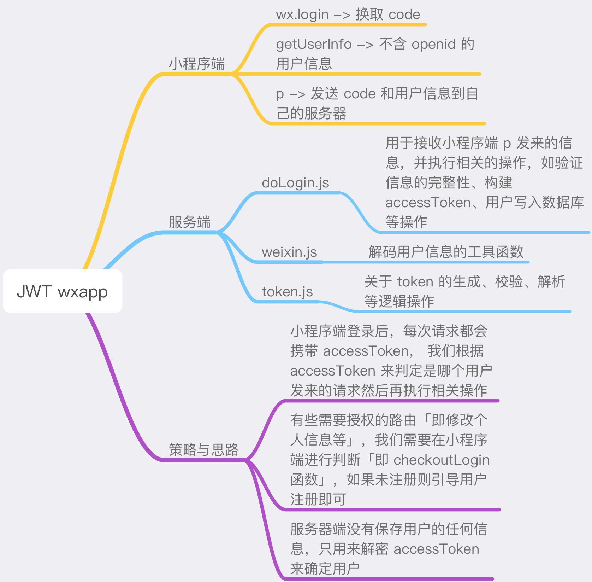

# panda-chat-room

#### 本节我们用 JWT 实现小程序本地用户标识

依然是从前端到后端， JWT 即 jsonwebtoken 是一种无状态化的认证手段。 在本节中我们采取 JWT 来达到在本地标识小程序用户的目的「作用类似于 session」。

1. JWT 是保存在小程序端的用户标识
1. JWT 不是一种保密措施，但它却是防篡改的「但是如果别人拿到了你的 JWT， 他就能冒充你」
1. 在服务器端我们不维护任何状态， 服务器只负责生成、解密、验证 JWT

##### 目录结构：

前端小程序

1. 前端 utils 文件为一些常用的工具函数
1. 前端 services 为微信登录函数

后端 koa

1. token.js JWT 的各类操作
1. doLogin.js 与微信服务器的交互，用于解密验证用户信息，用户信息写库、生成 JWT
1. weixin.js 微信用户的解密算法

##### 资料

[JSON Web Token - 在Web应用间安全地传递信息](https://blog.leapoahead.com/2015/09/06/understanding-jwt/)

[理解JWT的使用场景和优劣](http://blog.didispace.com/learn-how-to-use-jwt-xjf/)

## 注意事项

此 demo 中的所有配置信息有可能随时失效
