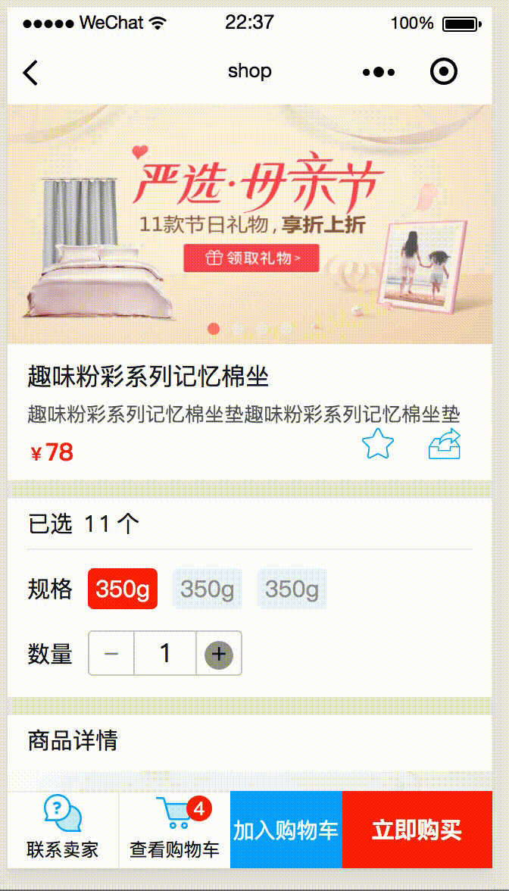

# panda shop

### 本节我们以一个微型商城来熟悉小程序的业务操作

从前端到后端，在本节我们主要通过用户的注册登录及购物车添加选取来进一步实现一个简单的商城模型，计划实现以下功能：

1. 基本的商城 UI 组件 ☑️
1. 用户登录注册 ☑️
1. 购物车逻辑  ☑️

#### 启动项目

前台小程序 / client 文件夹

后台 koa2 / server 文件夹

启动项目前你需要配置小程序并启动 mysql 数据库，大部分配置选项在 server 下的 config.js 内。

1. 小程序 appId、 appSecrct、 商户号 mch_id、 商户 API 秘钥  partner_key

1. mysql 数据库配置有 host、 数据库名称 db、 数据库账号 dbuser、 数据库密码 dbpass、 JWT 加密秘钥 jwtpassword

你必须先启动 mysql 数据库，然后再 `npm install && node app.js`

如果你使用 docker 你可以参考 server 项目内的 Dockerfile、 docker-compose.yml 文件，然后在 config.js 内修改相应配置即可。

在 server 和 client 下有相应的 README.me 文件以便让你了解整个项目结构

##### 用户注册登录

在用户注册登录方面，我们使用 jsonwebtoken 验权配合本地储存来完成

1. JWT 是保存在小程序端的用户标识
1. JWT 不是一种保密措施，但它却是防篡改的「但是如果别人拿到了你的 JWT， 他就能冒充你」。在我们的小程序中我们会在用户进行某些敏感操作时强制用户重新登录进而降低用户被冒充的风险
1. 在服务器端我们不维护任何状态， 服务器只负责生成、解密、验证 JWT

##### 购物车逻辑

对于我们的购物车来说，只实现基本的操作逻辑，并不涉及优惠券、满减等额外操作

在我们的项目里我们把购物车抽象成一个数组，这个商品原数组不区分商品是否重复并且把每个商品的 count 数都设置为 1。然后我们在购物车模块内我们会对其进行 “校正”，对所有的商品进行归类并计算数量。这样做的目的是为了在添加商品时更方便：不必查询到底是哪个商品然后再对其进行计数操作

1. 为了演示简便，我们的购物车列表以本地储存的方式实现
1. 购物清单的原数据结构抽象为简单的对象数组
1. 在添加新商品到购物车时会直接添加到购物清单数组内；但是在购物车模块内我们会对其分组并记录数量，即对购物列表内原数据进行校正，相同的商品对象合并为同一个商品对象
1. 购物车状态管理： 单独商品的增减、数量修改、是否选定、购物车总体选定、商品删除、价格计算

##### 资料

[用 JWT 实现小程序本地用户标识](https://github.com/hiscc/panda-chat-room/tree/jwtLogin)

## 注意事项

此 demo 中的所有原始配置信息有可能随时失效
